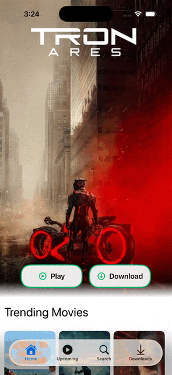
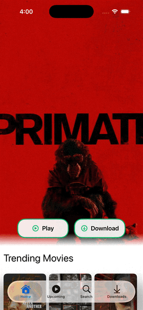
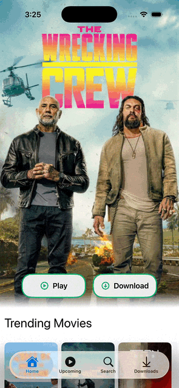
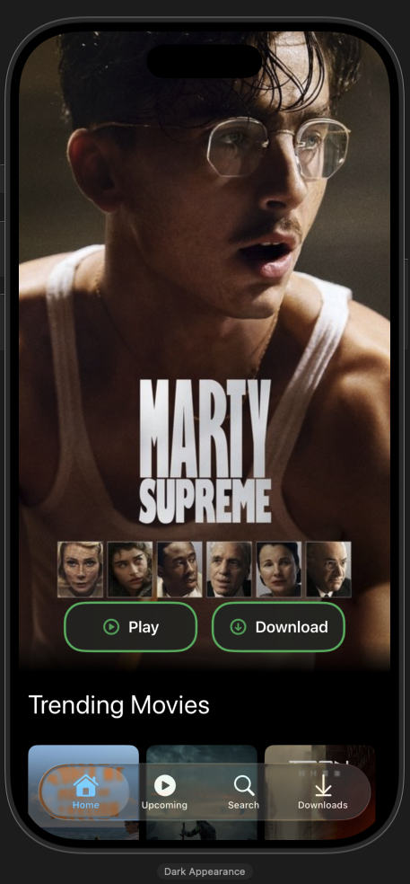

# MovieApp (SwiftUI)

This is from a [YouTube tutorial](https://youtu.be/-VC3hIEL7eQ?si=pUnrh9CmDr2saN8p) with some of my own modifications.

A simple movie and TV shows browsing app built with **SwiftUI** and **SwiftData**. 
Browse trending and top-rated titles, see upcoming movies, search movies/TV, watch a 
trailer, and save titles to your downloads list.

## Features

- **Home**: hero banner + rows for trending/top-rated Movies and TV
- **Upcoming**: upcoming movies list
- **Search**: search movies/TV (toggle) with a poster grid
- **Title Details**: trailer player + overview + download
- **Downloads**: saved titles (SwiftData) with swipe-to-delete

## Screenshots

### Home



### Title Details



### Upcoming



### Search


### Downloads


### Home (Dark)



## Tech Stack

- **SwiftUI** for UI
- **SwiftData** for persistence
- **Async/Await** networking with `URLSession`
- APIs:
  - **TMDB** (trending/top-rated/upcoming/search + posters)
  - **YouTube Data API** (trailer search)

## Getting Started

### Prerequisites

- **Xcode 15+** (recommended)
- iOS Simulator / device with **iOS 17+** (SwiftData)

### API Configuration

The app loads API settings from `MovieApp/APIConfig.json` via `APIConfig.swift`.

Create/update `MovieApp/APIConfig.json` with your own keys:

```json
{
  "tmdbBaseURL": "https://api.themoviedb.org",
  "tmdbAPIKey": "YOUR_TMDB_KEY",
  "youtubeAPIKey": "YOUR_YOUTUBE_KEY",
  "youtubeSearchURL": "https://www.googleapis.com/youtube/v3/search"
}
```

**Important:** Treat API keys as secrets. Avoid committing real keys to public repos.

### Run

1. Open `MovieApp.xcodeproj` in Xcode
2. Select a simulator/device
3. Build & run

## Credits / APIs

- Tutorial from BlossomBuild: [YouTube tutorial](https://youtu.be/-VC3hIEL7eQ?si=pUnrh9CmDr2saN8p)
- Data and images provided by **TMDB** (The Movie Database)
- Trailers searched via the **YouTube Data API**

